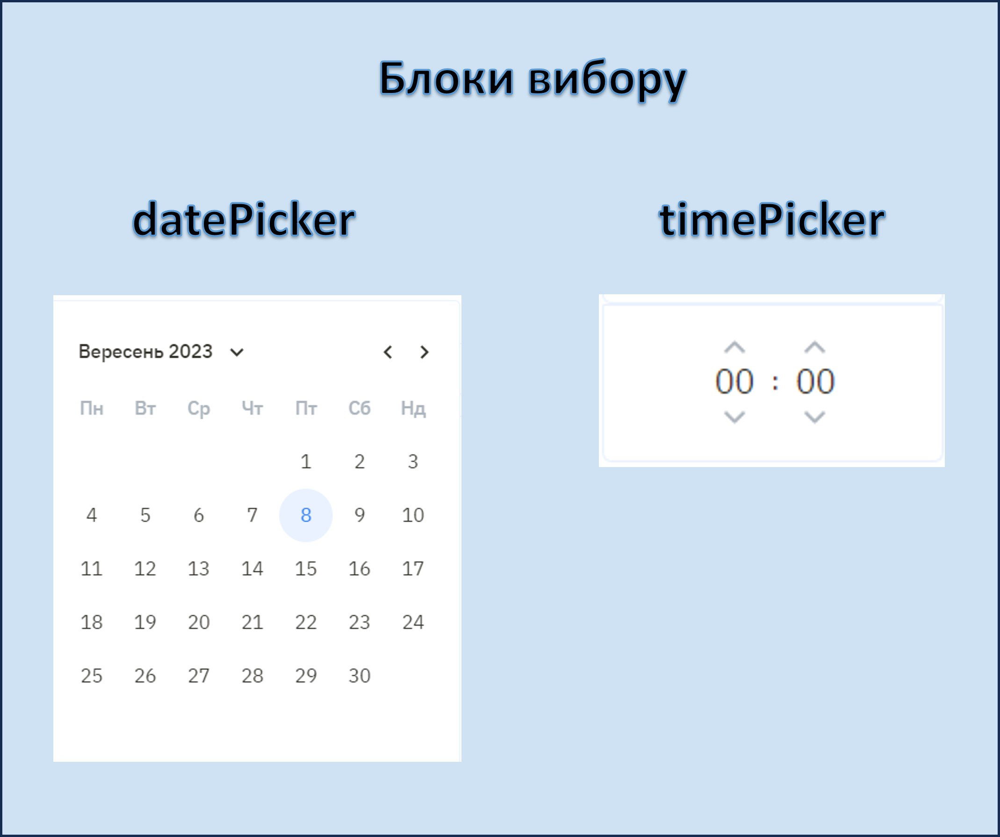
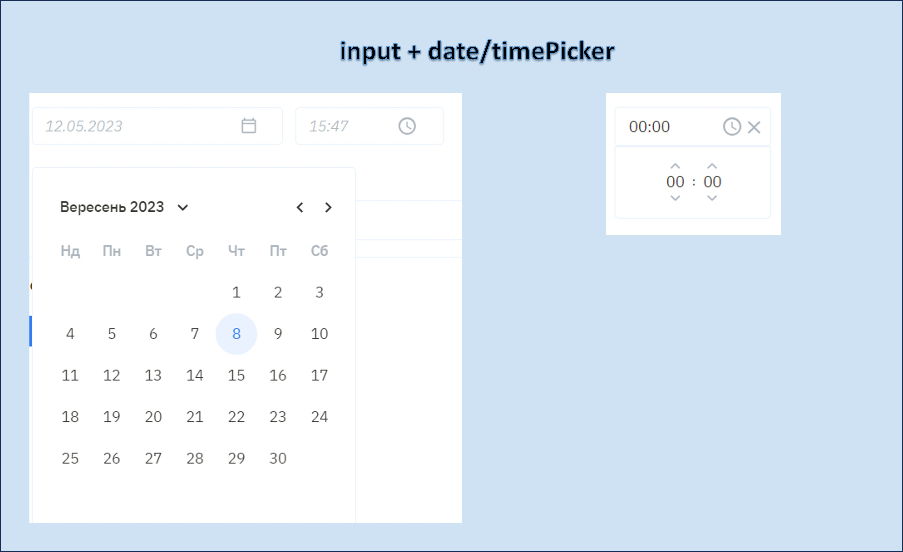
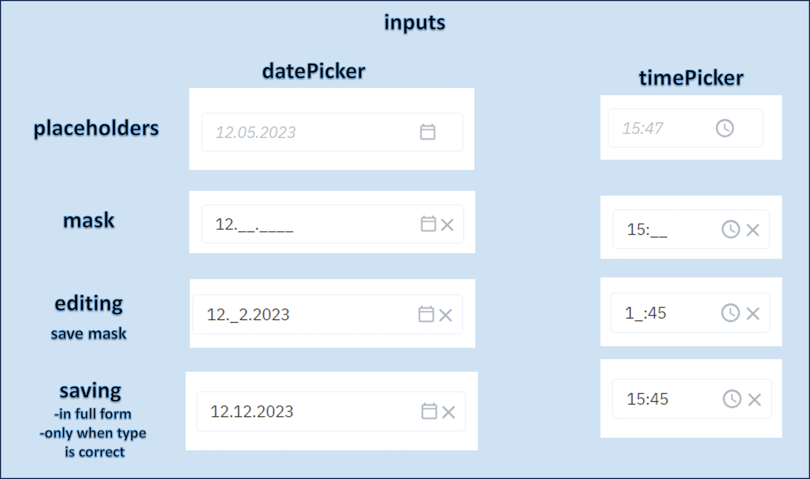
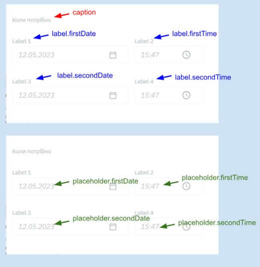
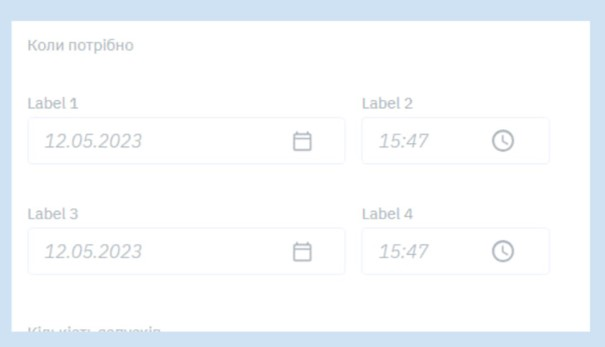

<meta name="viewport" content="width=device-width, initial-scale=1">
<link rel="stylesheet" href="github-markdown.css">
<link rel="stylesheet" href="https://cdnjs.cloudflare.com/ajax/libs/github-markdown-css/5.2.0/github-markdown-dark.css" integrity="sha512-6TNeuM0qy53coeyqVAiTdCjcBi26zGhbvVIjTOLNI0lcWW0Aoa3/TwMcPWNSjbmmK8nsCowwKIp9gnBCi4J3YQ==" crossorigin="anonymous" referrerpolicy="no-referrer" />
<style>
    .heading1 {
        color: teal;
        font-weight:700;
        font-size: 35px;
        text-align: center;
    }
    .heading2 {
        color: teal;
        font-weight:500;
        font-size: 20px;
        text-align: center;
    }
    .menu {
        position: fixed;
        top:150px;
        right:0;
        background-color: #112323;
        width: 200px;
        padding: 6px;
        color: white;
    }
    .property {
        color: teal;
        font-weight:500;
        font-size: 35px;
    }
    .body {
        padding-right: 200px;
    }
    .inProgress {
        color: red;
        font-style: italic;
        font-size: 12px;
    }
    .completed {
        color: green;
        font-style: italic;
        font-size: 12px;
    }
</style>

<div class="body">

<p class="heading1">Динамічні властивості</p>
<p class="heading2">для акордеонів правої панелі конструктора боту</p>

<div id="menu" class="menu">Зміст:

-[Datepicker](#Datepicker)  
-[SelectWithApiRequests](#SelectWithApiRequests)  
-[ContainersBox](#ContainersBox)  
-[Steps](#Steps)  
-[CustomField](#CustomField)

</div>  


##
## <p id="Datepicker" class="property">Datepicker</p>




### JSON

```json
{
    "caption": [
        {"lang": "UA", "value": ""},
        {"lang": "RU", "value": ""},
        {"lang": "EN", "value": ""}
    ],
    "placeholders": {
        "firstDate": [
            {"lang": "UA", "value": ""},
            {"lang": "RU", "value": ""},
            {"lang": "EN", "value": ""}
        ],
        "secondDate": [
            {"lang": "UA", "value": ""},
            {"lang": "RU", "value": ""},
            {"lang": "EN", "value": ""}
        ],
        "firstTime": [
            {"lang": "UA", "value": ""},
            {"lang": "RU", "value": ""},
            {"lang": "EN", "value": ""}
        ],
        "secondTime": [
            {"lang": "UA", "value": ""},
            {"lang": "RU", "value": ""},
            {"lang": "EN", "value": ""}
        ],
    },
    "labels": {
        "firstDate": [
            {"lang": "UA", "value": ""},
            {"lang": "RU", "value": ""},
            {"lang": "EN", "value": ""}
        ],
        "secondDate": [
            {"lang": "UA", "value": ""},
            {"lang": "RU", "value": ""},
            {"lang": "EN", "value": ""}
        ],
        "firstTime": [
            {"lang": "UA", "value": ""},
            {"lang": "RU", "value": ""},
            {"lang": "EN", "value": ""}
        ],
        "secondTime": [
            {"lang": "UA", "value": ""},
            {"lang": "RU", "value": ""},
            {"lang": "EN", "value": ""}
        ],
    },


    "property": "propertyName",
    "type": "DatePicker",
    "enabledRange": {
        "maxDate": "2023-09-01",
        "minDate": "2023-09-01",
    },
    "mode": "onlyDate",
    "defaultValue": "2023-09-01",
    "validation": {
        "maxDate": "2023-09-01",
        "minDate": "2023-09-01",
        "warningMessages": {
            "date": [
                {"lang": "UA", "value": ""},
                {"lang": "RU", "value": ""},
                {"lang": "EN", "value": ""}
            ]
        }
    },
    "visibilityRules": {


    }
}
```
### caption <span class="completed" >completed</span>
загальний заголовок динамічної властивості

### placeholders <span class="completed" >completed</span>
плейсхолдери для інпутів всіх блоків   
по дефотлу (якщо не передавати жодні) для дати: `12.05.2023` та для часу:  `15:47`
```typescript
{
    placeholders?: {
        firstDate?: string;
        firstTime?: string;
        secondDate?: string;
        secondTime?: string;
    };
}
```
## labels <span class="completed" >completed</span>
заголовки для інпутів всіх блоків 
по дефотлу відсутні




## enabledRange <span class="inProgress">in progress</span>
задає дату і час в межах якого дати календарика клікабельні (не дає вибрати поза проміжком maxDate minDate) in progress
формат або "2023-09-01T07:36" або "2023-09-01"


## validation (maxDate minDate) <span class="inProgress">in progress</span>
валідує вибране значення і виводить сповіщення про відхилення (дає можливість вибрати будь-яке значення, виведе червону рамку і сповіщення під нею у разі відхилень) in progress
формат або "2023-09-01T07:36" або "2023-09-01"
всі інші валідації відповідно до [dynamicValidation](https://docs.google.com/document/d/1u4lLZaTTvwPNFXAzuEwBeBkb5cTFIJXJG6ogHHsD2uw/edit)

## Mode types <span class="completed" >completed</span>
```
'onlyDate'
'onlyTime'
'dateWithTime'
'twoDates'
'twoTimes'
'twoDatesWithTime'
```

```"mode": "onlyDate"```  
"propertyName": "2023-09-01"  


```"mode": "onlyTime"```  
"propertyName": "07:36"  


```"mode": "dateWithTime"```  
"propertyName": "2023-09-01T07:36"  


```"mode": "twoDates"```  
"propertyName": ["2023-09-01","2023-09-09"]  


```"mode": "twoTimes"```  
"propertyName": ["07:35","07:36"]  


```"mode": "twoDatesWithTime"```  
"propertyName": ["2023-09-01T07:35","2023-09-09T07:36"]  



## DefaultValue <span class="completed" >completed</span>
повинне бути задано відповідним форматом залежно від mode

```json
"defaultValue": "2023-09-01"
"defaultValue": "07:36"
"defaultValue": "2023-09-01T07:36"
"defaultValue": ["2023-09-01","2023-09-09"]
"defaultValue": ["07:35","07:36"]
"defaultValue": ["2023-09-01T07:35","2023-09-09T07:36"]
```


##
## <p id="SelectWithApiRequests" class="property">SelectWithApiRequests</p>


##
## <p id="ContainersBox" class="property">ContainersBox</p>


##
## <p id="Steps" class="property">Steps</p>


##
## <p id="CustomField" class="property">CustomField</p>

</body>
